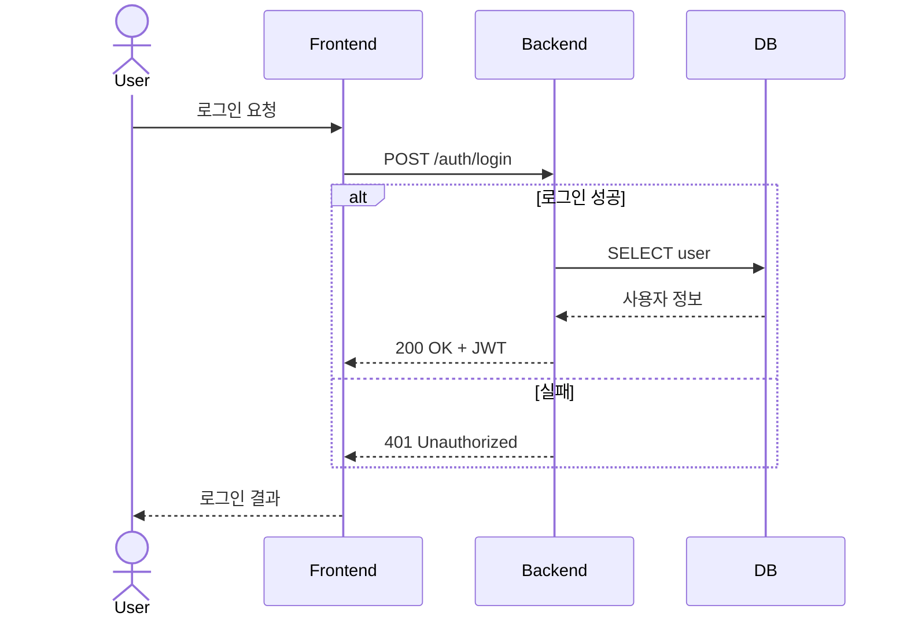
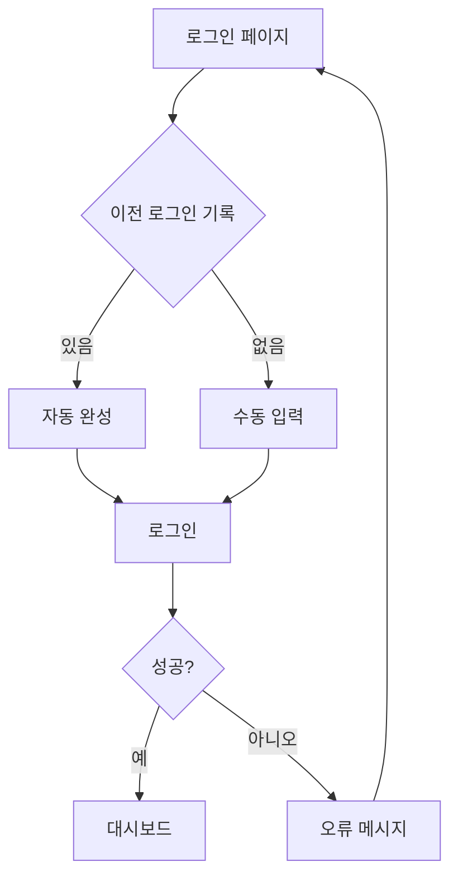

# 기획 하네스 - Claude 규칙서

## 목적
이 규칙서는 기획자가 상세기획 단계를 자동화하기 위해 Claude를 사용할 때 지켜야 할 원칙과 프로세스를 정의합니다.

---

## 🎯 4대 구성요소

### 1. Context (컨텍스트)
**목표**: Claude가 서비스의 핵심 정책을 항상 인지하도록

- `spec.md`에 명시된 서비스 요구사항을 매 요청 시 함께 제시
- 기존 요구사항·플로우·테스트 케이스 문서 참조
- "진실의 원천"은 항상 `spec.md`

**사용자 역할**:
```
Claude, spec.md를 참고해서 다음을 진행해줘:
[작업 내용]
```

### 2. Tool Definition (도구 정의)
**목표**: 정해진 8개 스킬만 사용해 일관성 있는 산출물 생성과 개발 핸드오프 수행

정해진 스킬:
- `/search-documents` — 근거 자료 검색
- `/split-requirements` — 요구사항 분해
- `/sequence-diagram` — 시퀀스 다이어그램
- `/user-flow` — 사용자 플로우
- `/logic-check` — 예외·테스트 케이스
- `/release-note` — 변경사항 요약
- `/git-project-sync` — Git Issue & Project 생성
- `/dev-handoff` — 승인된 기획을 개발 repo 이슈/@claude PR 작업으로 연결

**규칙**:
- 이 8개 스킬 외에 다른 작업은 하지 않음
- 각 스킬의 입출력 규약을 정확히 따름
- 스킬 체인: 보통 `/search-documents` → `/split-requirements` → `/sequence-diagram`/`/user-flow` → `/logic-check` → `/release-note` → `/git-project-sync` → `/dev-handoff`

### 3. Guardrails (가드레일)
**목표**: 위험·불확실한 작업은 항상 사람이 승인 후 진행

**승인 필요한 작업**:
- [ ] `/split-requirements` 최종 결과 (변경사항이 크면 사람이 검토 필수)
- [ ] `/logic-check`의 테스트 케이스 (비즈니스 요구사항과 부합하는지 확인)
- [ ] `/git-project-sync`로 Git Issue·Project 반영 (실제 생성 전 확인)
- [ ] `/dev-handoff`로 개발 repo 이슈 생성 또는 `@claude` 트리거 제안 (실제 생성 전 확인)

**승인 전 Claude의 역할**:
```
위의 작업이 이 요구사항을 정확히 반영했는지 확인해주세요:
[승인해야 할 내용]

아래 체크리스트를 확인하신 후 "승인" 또는 "수정" 요청해주세요:
- [ ] 요구사항과 정확히 매칭
- [ ] 기존 아키텍처와 충돌 없음
- [ ] 테스트 케이스 완전함
```

### 4. Verification (자동 검증)
**목표**: 산출물이 `spec.md` 의도와 부합하는지 AI가 검증

**자동 검증 체크**:
```
spec.md의 요구사항:
1. [요구사항 1] → 산출물에서 확인: ✓/✗
2. [요구사항 2] → 산출물에서 확인: ✓/✗
...

검증 결과: [Pass/Fail]
```

**Fail 시 처리**:
- 불일치 부분 명시
- 수정 필요한 항목 리스트업
- 사용자에게 수정 재요청

---

## 📋 스킬별 규칙

### /search-documents
**입력**: 검색할 주제
**출력**: `docs-found.md` (발견된 근거 자료 목록)
**프로세스**:
1. 저장소의 기존 문서 검색
2. NotebookLM 기반 지식 검색
3. 관련 GitHub Issues 검색
4. 결과를 카테고리별로 정리

**예시**:
```markdown
## 검색 결과: "사용자 인증 프로세스"

### 기존 문서
- spec.md § 인증 흐름
- README.md § 보안 정책

### 관련 Issues
- #12: 2FA 구현
- #18: OAuth 연동

### NotebookLM 관련 노트
- 인증 규칙서.md
```

### /split-requirements
**입력**: 큰 기능 명세
**출력**: `requirements.md` (세부 요구사항 목록)
**프로세스**:
1. 큰 기능을 작은 단위로 분해
2. 각 세부 기능의 전제조건·후행 작업 명시
3. 우선순위 표시 (필수/선택)
4. 의존성 그래프 표시

**예시**:
```markdown
## 요구사항 분해: "사용자 관리 대시보드"

### Phase 1 (필수)
- [ ] 사용자 목록 조회 API
- [ ] 필터링 기능
- [ ] 페이징

### Phase 2 (선택)
- [ ] 사용자 상세 정보 모달
- [ ] 일괄 작업 (삭제/상태변경)

### 의존성
Phase 1 완료 → Phase 2 시작
```

**승인 체크**:
- 기존 spec.md와 충돌 없는가?
- 모든 요구사항이 포함되었는가?
- 누락된 기능이 있는가?

### /sequence-diagram
**입력**: 백엔드 로직 설명
**출력**: `sequence.mermaid` (시퀀스 다이어그램)
**규칙**:
- Mermaid 시퀀스 다이어그램 포맷 필수
- 주요 액터: User, Frontend, Backend, Database 등
- 에러 케이스 포함
- 각 스텝에 번호 메기기

**예시**:


### /user-flow
**입력**: 사용자 시나리오
**출력**: `user-flow.mermaid` (플로우 차트)
**규칙**:
- Mermaid flowchart 포맷
- 모든 분기점 포함
- 사용자 결정 지점 표시
- 시스템 오류 처리 경로

**예시**:


### /logic-check
**입력**: 요구사항 + spec.md
**출력**: `logic-check.md` (예외·테스트 케이스)
**프로세스**:
1. 정상 흐름 테스트 케이스
2. 예외 상황 (null, 제한값, 동시성)
3. 보안 관련 케이스
4. 성능 케이스 (대량 데이터)

**예시**:
```markdown
## 테스트 케이스: "사용자 등록"

### 정상 케이스
- [ ] TC-001: 유효한 이메일·비번 등록 → 성공

### 예외 케이스
- [ ] TC-002: 중복 이메일 → "이미 가입됨" 메시지
- [ ] TC-003: 빈 필드 → 유효성 검사 오류
- [ ] TC-004: 약한 비번 → "비번 요구사항 미충족"

### 보안 케이스
- [ ] TC-005: SQL Injection 시도 → 안전 처리
- [ ] TC-006: XSS 공격 → 이스케이프 처리

### 성능 케이스
- [ ] TC-007: 1,000명 동시 등록 → 완료 시간 < 5초
```

**검증**:
- spec.md 요구사항 모두 커버되었나?
- 비즈니스 규칙 모두 포함되었나?

### /release-note
**입력**: 변경 내용 + 영향도
**출력**: `release-note.md` (변경사항 요약)
**포맷**:
```markdown
## v1.2.0 - 2026-06-30

### 🎯 주요 변경사항
- 사용자 인증 개선
- 대시보드 성능 최적화

### 📝 상세 변경
- [#44] 기획 하네스 도입
- [#45] DB 인덱스 추가

### ⚠️ Breaking Changes
- 로그인 API 응답 형식 변경
- 레거시 토큰 지원 중단

### 🔧 마이그레이션 가이드
기존 클라이언트 업데이트 필요:
[링크]
```

### /git-project-sync
**입력**: Issue 목록 + 프로젝트 정보
**출력**: `git-sync.json` (동기화 결과)
**프로세스**:
1. GitHub Issues 생성 (레이블, 담당자, 마감일 포함)
2. Git Project V2에 추가
3. 상태 초기값: "Todo"
4. 우선순위 설정

**생성 규칙**:
```json
{
  "issues": [
    {
      "title": "요구사항 1",
      "body": "상세 설명",
      "labels": ["from-meeting", "todo"],
      "assignee": "담당자",
      "milestone": null,
      "project": "기획 루프"
    }
  ]
}
```

**승인 전 확인**:
- 이슈 제목이 명확한가?
- 담당자가 실제로 가능한가?
- 마감일이 현실적인가?

### /dev-handoff
**입력**: 대상 개발 repo + 승인된 기능/산출물
**출력**: `dev-handoff.md` (개발 repo 이슈 본문 + 추천 `@claude` 트리거)
**프로세스**:
1. `spec.md` 와 관련 `outputs/<날짜>/` 산출물 확인
2. 개발 repo 이슈 본문으로 문제·범위·인수조건·테스트 기준 정리
3. dry-run 제안 출력
4. 승인 후에만 `gh issue create --repo <target>` 실행
5. 개발 repo 의 Claude Code Action 이 `@claude` 댓글/라벨로 branch + PR 생성

**승인 전 확인**:
- 대상 repo 가 정확한가?
- 구현 범위가 충분히 작고 테스트 가능한가?
- raw 회의록이나 민감정보가 포함되지 않았는가?
- 봇이 merge/deploy 없이 PR까지만 만들도록 명시했는가?

---

## 📌 기본 프로세스

### 상세기획 시작
1. **배경 설정**: spec.md 제시
2. **검색**: `/search-documents` 실행
3. **분해**: `/split-requirements` 실행 (승인 필요)
4. **시각화**: `/sequence-diagram` + `/user-flow` 실행
5. **검증**: `/logic-check` 실행 (승인 필요)
6. **공유**: `/release-note` 실행
7. **추적**: `/git-project-sync` 실행 (승인 필요)
8. **개발 핸드오프**: `/dev-handoff` 실행 (승인 필요)

### 회의록 자동화
1. 녹음 → STT → `meetings/raw/YYYY-MM-DD_meeting.txt`
2. `scripts/summarize_meeting.py` → `meetings/summary/YYYY-MM-DD_meeting.md`
3. 회의록의 "## 할 일" 파싱
4. `/git-project-sync` 실행 → Issues + Project 생성
5. 승인된 항목은 `/dev-handoff` → 개발 repo Issue → `@claude` PR 생성

---

## ⚠️ 금지된 행동

❌ **다음은 절대 하지 않기**:
- spec.md 없이 작업 진행 (항상 "진실의 원천" 확인)
- 8개 스킬 외의 산출물 생성 (이탈 방지)
- 사용자 승인 없이 Git Issue 생성 (역할 분담 유지)
- 사용자 승인 없이 개발 repo 이슈 생성, `@claude` 트리거, PR/배포 수행
- 기존 산출물 무시하고 새로 작성 (기존 문서 활용)
- 모호한 상황에서 결정 (항상 사용자에게 확인)

---

## 📚 참고 파일
- `spec.md` — 진실의 원천
- `README.md` — 사용 가이드
- `meetings/README.md` — 회의록 관리
- `scripts/` — 자동화 스크립트
- `docs/remote-dev-platform.md` — 원격·모바일·개발 봇 운영 설계
