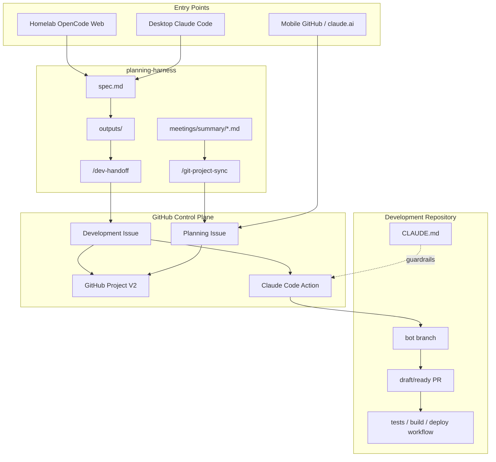

# Remote Dev Platform Blueprint

> Phase 4/5 design for using planning-harness from desktop, mobile, and a homelab-style web agent, then handing approved planning work to development repositories through GitHub Issues, Projects, Actions, and bot-created PRs.

## Goal

planning-harness should stay the planning control plane:

- planners write or approve `spec.md`, meeting summaries, and `outputs/<date>/` planning artifacts;
- `/git-project-sync` turns meeting action items into GitHub Issues/Project items;
- `/dev-handoff` turns an approved planning artifact into a development issue in a target repo;
- a development repo's GitHub Action responds to `@claude`, issue assignment, or a label and creates a branch/PR;
- humans review and merge PRs; deployments remain owned by the development repo's normal CI/CD or GitOps path.

The important boundary is: agents may propose and open PRs, but they should not directly deploy, change secrets, or bypass review.

## Reference Pattern

This is modeled on a homelab AI dev platform pattern:

- [Rsgm, "My Homelab AI Dev Platform"](https://rsgm.dev/post/ai-dev-platform/) describes self-hosting OpenCode Web for GitOps-style homelab changes.
- [Anthropic Claude Code Action README](https://github.com/anthropics/claude-code-action) describes the GitHub Action for PRs and issues.
- [Claude Code Action usage guide](https://github.com/anthropics/claude-code-action/blob/main/docs/usage.md) documents the current `@claude`, label, assignee, `plugin_marketplaces`, and `plugins` workflow inputs.

## System Shape



## Operating Loop

1. Planning starts on desktop or homelab web:
   - fill `spec.md`;
   - run `/search-documents`, `/split-requirements`, `/sequence-diagram`, `/user-flow`, `/logic-check`;
   - keep approvals for risky planning outputs.

2. Meeting actions become tracked work:
   - write `meetings/summary/YYYY-MM-DD_meeting.md`;
   - run `/git-project-sync YYYY-MM-DD`;
   - review dry-run output;
   - approve before applying `--yes`.

3. Approved planning becomes development work:
   - run `/dev-handoff <target-repo> <feature or artifact>`;
   - review the generated handoff issue body;
   - approve issue creation in the target development repo.

4. Development bot starts only after a human trigger:
   - comment `@claude implement this issue and open a PR`;
   - or add a `claude` / `claude-ready` label if the target repo workflow enables label triggers;
   - Claude Code Action creates a branch and PR.

5. Human review remains the release gate:
   - CI runs in the target repo;
   - maintainers review the PR;
   - merge triggers the target repo's normal deploy workflow.

## Repository Roles

### planning-harness

Owns the planning loop, reusable commands, templates, and cross-repo handoff format. It does not own application deployment.

Required files:

- `.claude/commands/dev-handoff.md`
- `templates/dev-repo/planning-handoff.md`
- `templates/github-actions/claude-dev-bot.yml`
- `templates/dev-repo/CLAUDE.md`

### Development Repositories

Each development repo installs or copies:

- `.github/workflows/claude-dev-bot.yml` copied from `templates/github-actions/claude-dev-bot.yml`;
- `CLAUDE.md` adapted from `templates/dev-repo/CLAUDE.md`;
- `.harness/config.env` if planning-harness commands should create issues in that repo/project.

## GitHub Setup

In the development repo:

1. Install the Claude Code GitHub app or configure the action manually.
2. Add `ANTHROPIC_API_KEY` or `CLAUDE_CODE_OAUTH_TOKEN` as a repository secret.
3. Copy `templates/github-actions/claude-dev-bot.yml` to `.github/workflows/claude-dev-bot.yml`.
4. Copy `templates/dev-repo/CLAUDE.md` to `CLAUDE.md` and adapt repo-specific build/test commands.
5. Create labels:
   - `from-planning`
   - `claude-ready`
   - `claude`
6. Protect `main` and require PR review/CI before merge.

## Mobile/Homelab Entry Points

- Mobile GitHub app: approve project items, add labels, comment `@claude`, review PRs.
- claude.ai/mobile browser: edit or review planning text, then let GitHub be the durable action surface.
- Homelab OpenCode Web: use as a browser-accessible coding/ops console, preferably behind VPN or Zero Trust access.

## Safety Gates

Agents must not:

- write to GitHub Projects without dry-run and approval from planning-harness;
- push directly to `main`;
- deploy directly from a bot session;
- edit repository secrets, environments, branch protections, or access controls;
- copy raw meeting transcripts into issues, PRs, or commits;
- touch repos outside the configured target repo/project.

Preferred safe path:

```text
planning artifact -> handoff issue -> @claude -> branch -> PR -> CI -> human merge -> deploy
```

## First Validation

Use a low-risk downstream repo first.

1. Install the workflow template in the target repo.
2. Create one handoff issue from `outputs/2026-06-30/requirements.md`.
3. Trigger `@claude` with a documentation-only task.
4. Confirm the bot opens a branch/PR and does not merge or deploy.
5. Add the issue/PR to the GitHub Project and verify status transitions.
