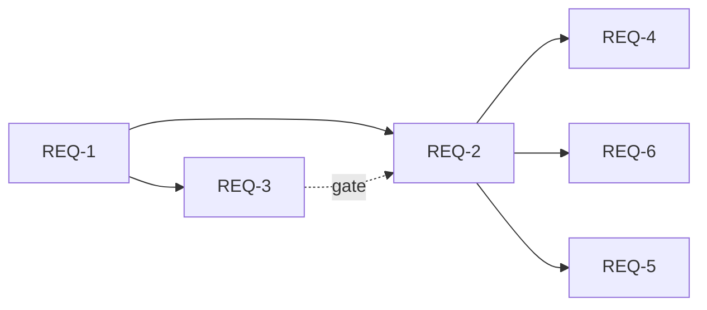

## 요구사항 분해: "회의록 → GitHub Issue/Project 자동 동기화"

> `/split-requirements` 산출물 · 2026-06-30 · ⚠️ 사람 승인 필요

### Phase 1 (필수)
- [ ] [REQ-1] 회의록 `## 할 일` 파싱 (FR-001) — 전제: summary.md 존재 / 후행: REQ-2
- [ ] [REQ-2] 이슈 생성 + Project 추가, 멱등 (FR-002) — 전제: REQ-1, gh 인증 / 후행: REQ-4
- [ ] [REQ-3] dry-run 제안 + 승인 게이트 (FR-003) — 전제: REQ-1 / 모든 쓰기를 감쌈
- [ ] [REQ-4] 결과 리포트 `git-sync.json` — 전제: REQ-2

### Phase 2 (선택)
- [ ] [REQ-5] Python 보조 경로 (FR-004) — 전제: REQ-1~4 동작 확정
- [ ] [REQ-6] reconcile(개별 상태/우선순위 조정) — 전제: REQ-2

### 의존성

### 자가검증 (spec.md 매핑)
| spec FR | 분해 매핑 | 커버 |
|---|---|---|
| FR-001 파싱 | REQ-1 | ✓ |
| FR-002 생성·멱등 | REQ-2 | ✓ |
| FR-003 승인 게이트 | REQ-3 | ✓ |
| FR-004 Python 보조 | REQ-5 | ✓ |

---
**승인 요청** — 아래를 확인해주세요:
- [ ] spec.md 와 충돌 없음
- [ ] 모든 요구사항 포함 (누락 없음)
- [ ] 기존 아키텍처와 충돌 없음

"승인" 또는 "수정 요청"을 알려주세요.
