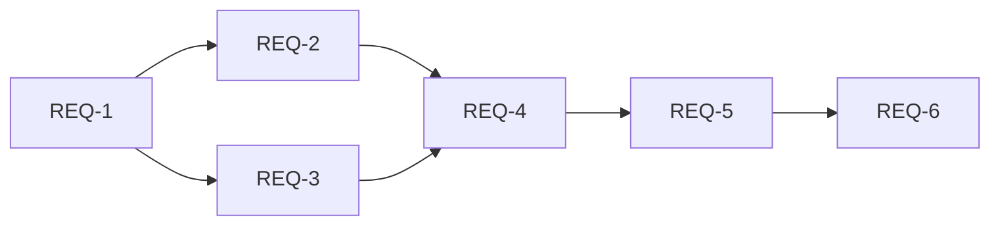

## 요구사항 분해: "kiba_2026 기획 하네스 통합"

> `/split-requirements` 산출물 · 2026-07-01 · ⚠️ 사람 승인 필요
> 진실의 원천: [kiba2026-spec.md](kiba2026-spec.md)

---

### Phase 1 (필수) — 설치

- [ ] [REQ-1] planning-harness 7개 스킬 파일 복사 (FR-001)
  - 전제: feed-mina/planning-harness 최신 커밋
  - 후행: REQ-2
  - 방법: `publish-planning-harness.yml` 이 kiba_2026/planning-harness/ 동기화 → 또는 수동 복사
- [ ] [REQ-2] `.harness/config.env` 작성 (FR-002)
  - 전제: REQ-1
  - 후행: REQ-4
  - 필드: OWNER=feed-mina, PROJECT_NUMBER=?, REPO=kiba_2026, LABEL_MEETING=from-meeting
- [ ] [REQ-3] harness-bot.yml 설치 (FR-003)
  - 전제: ANTHROPIC_API_KEY 시크릿
  - 후행: REQ-4
  - 방법: `templates/harness-bot.yml` → `.github/workflows/harness-bot.yml`

### Phase 2 (필수) — 관통 테스트

- [ ] [REQ-4] `/git-project-sync` 첫 실행 (FR-004)
  - 전제: REQ-2, REQ-3, gh 인증
  - 방법: `@claude /git-project-sync 2026-07-01` 코멘트
  - 성공 기준: git-sync.json + Issues 1건+ 생성

### Phase 3 (선택) — 회의록 파이프라인 연결

- [ ] [REQ-5] `meetings/summary/` 에 회의록 1건 추가
  - 전제: REQ-4 성공
  - 방법: `templates/meeting_template.md` 복사 → `meetings/summary/2026-07-01_meeting.md`
- [ ] [REQ-6] summarize_meeting.py 실행 검증 (kiba_2026 환경)
  - 전제: REQ-5, GEMINI_API_KEY 또는 OPENAI_API_KEY

---

### 의존성

---

### 자가검증 (spec.md 매핑)

| spec FR | 분해 매핑 | 커버 |
|---------|---------|------|
| FR-001 플러그인 설치 | REQ-1 | ✓ |
| FR-002 config.env | REQ-2 | ✓ |
| FR-003 harness-bot.yml | REQ-3 | ✓ |
| FR-004 관통 테스트 | REQ-4 | ✓ |
| NFR-001 공존 | REQ-3 (트리거 분리) | ✓ |
| NFR-002 보안 | REQ-3 (시크릿 마스킹) | ✓ |

---

**⚠️ 승인 요청** — 아래를 확인해주세요:
- [ ] kiba_2026 PROJECT_NUMBER 를 알고 있나요? (`gh project list --owner feed-mina` 로 확인)
- [ ] ANTHROPIC_API_KEY 시크릿이 kiba_2026 레포에 설정돼 있나요?
- [ ] `publish-planning-harness.yml` 이 자동 동기화(kiba→harness)를 이미 처리하나요, 아니면 수동 복사가 필요한가요?

"승인" 또는 "수정 요청"을 알려주세요.
