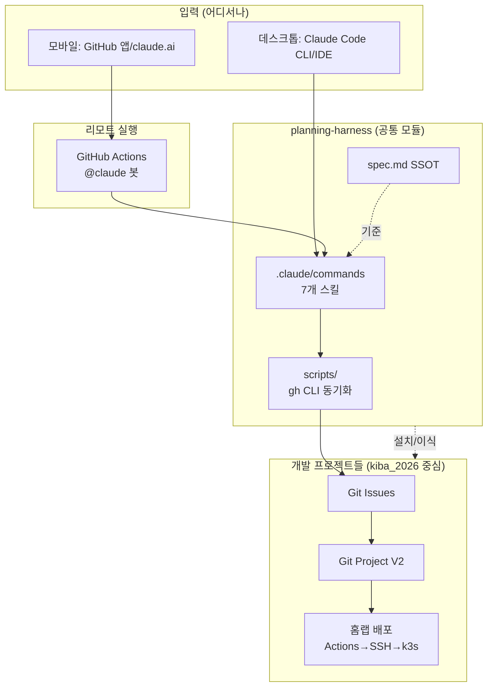

# planning-harness — 현황 분석 & 목표 플랜

> 작성일: 2026-06-30 · 작성: Claude · 진실의 원천: [spec.md](../spec.md)

---

## 1. 지금 폴더에 무엇이 있나 (현황 분석)

### 1-1. planning-harness 본체 (= 추적 대상, 우리 repo)

| 파일/폴더 | 정체 | 상태 |
|---|---|---|
| `CLAUDE.md` | **기획 하네스 규칙서** — 4대 구성요소(Context·Tool·Guardrail·Verification) + 7개 스킬 입출력 규약 | ✅ 완성도 높음 (설계서) |
| `spec.md` | **진실의 원천(SSOT) 템플릿** — 요구사항/플로우/테스트/마일스톤 빈 양식 | ⚠️ 템플릿 상태 (실제 기획 내용 없음) |
| `README.md` | 10분 빠른 시작 | ⚠️ 없는 파일을 가리킴(아래 1-3) |
| `SETUP.md` | 초기 설정 가이드 (Python + GITHUB_TOKEN + REST) | ⚠️ 없는 파일을 가리킴 |
| `.claude/commands/` | 7개 스킬이 들어가야 할 곳 | ❌ **비어 있음**(.gitkeep만) |
| `outputs/` | 산출물 저장소 | 비어 있음(.gitkeep) |

### 1-2. 참고용으로 클론한 3개 외부 repo (= 추적 제외, .gitignore 처리 완료)

| repo | 이 프로젝트에 주는 의미 | 핵심 차용 포인트 |
|---|---|---|
| **project_management_with_ai_agent** (KIBA) | 🎯 **우리가 만들려는 엔진의 정답지.** 회의록 → GitHub Projects 보드 동기화 + 사람 승인 루프 | `scripts/lib.sh·board.sh·reconcile.sh` (gh CLI 기반, ID 하드코딩 없이 런타임 해석), `CLAUDE.md`의 Confirmation Policy |
| **kiba_2026** (KIBA) | 🎯 **하네스가 관리할 "다운스트림 개발 프로젝트"의 표본.** 첫 실제 기능 검증 대상 저장소 | `feed-mina/kiba_2026` 기반 이슈/프로젝트 연동 검증 |
| **llm-app-lab** | LLM 앱 구축 학습 랩 | GitHub Pages 워크플로, 참고 자료 |

### 1-3. ⚠️ 문서 ↔ 실제 불일치 (지금 가장 큰 갭)

README/SETUP는 아래를 "있다"고 전제하지만 **실제로는 전부 없음**:
- `.claude/commands/` 안의 7개 스킬 파일
- `scripts/create_github_issues.py`, `scripts/sync_project.py`
- `templates/meeting_template.md`
- `meetings/` 디렉토리

> 즉, planning-harness는 현재 **"설계도(CLAUDE.md)는 훌륭한데 엔진은 아직 0%"** 인 상태입니다.
> 그리고 SETUP은 Python+REST 방식을 말하지만, 옆의 KIBA repo는 더 깔끔한 **gh CLI 방식**을 이미 검증해 두었습니다. → gh CLI로 통일 권장.

---

## 2. 목표 재정의

1. **기획 하네스 루프 에이전트를 데스크톱 + 모바일에서** 사용
2. **GitHub Actions / git 봇 / 홈랩** 패턴 차용해 **리모트로 프로젝트 관리**
3. 이 프로젝트를 **공통 모듈(common module)** 로 만들어 다른 개발 프로젝트에 이식
4. 개발 프로젝트에서는 **Git Issue / Git Project** 로 이어져 실제 관리

### 목표 아키텍처

---

## 3. 단계별 플랜

### Phase 0 — 정리 & 진실 맞추기 ✅ 완료
- [x] 외부 3개 repo `.gitignore` 처리
- [x] README/SETUP를 "실제 상태"에 맞게 수정 (gh CLI 우선, 슬래시 커맨드 워크플로, Phase 표기)
- [x] GitHub 연동 방식을 **gh CLI 기본 + Python 보조**로 확정
- [x] `templates/meeting_template.md`, `meetings/{raw,summary}` 스캐폴딩 + raw gitignore
- [x] 첫 시드 기획 `spec.md` 작성 (`/git-project-sync` 기능) + 7스킬 관통 검증 (빈 템플릿은 `templates/spec_template.md` 보존)

### Phase 1 — 7개 스킬 실제 구현 ✅ 완료
`.claude/commands/*.md` 슬래시 커맨드 7개 구현 (CLAUDE.md 규약 준수, 산출물 `outputs/<날짜>/`, 승인 게이트 3종 반영):
- [x] `/search-documents` `/split-requirements`⚠️ `/sequence-diagram` `/user-flow` `/logic-check`⚠️ `/release-note` `/git-project-sync`⚠️
- (⚠️ = 사람 승인 게이트)

### Phase 2 — git-project-sync 엔진 (KIBA 차용) ✅ 완료
- [x] KIBA `lib.sh / board.sh / reconcile.sh` 이식·일반화 (`config.env` 만 바꾸면 동작)
- [x] `parse_actions.py` (회의록 `## 할 일` 파서) + `create_issues.sh` (이슈+Project, dry-run→`--yes`)
- [x] Python 보조 `github_sync.py` (stdlib REST/GraphQL, gh 없는 환경)
- [x] `scripts/README.md`, `/git-project-sync` 커맨드를 실엔진에 연결
- 멱등·중복방지·노드ID 런타임해석·회의록 원문 비노출 가드레일 반영

### Phase 3 — 공통 모듈화 (Claude Code 플러그인) ✅ 완료
- [x] `.claude-plugin/plugin.json` (commands=`./.claude/commands` 재사용, 중복 0) + `marketplace.json` (source ".")
- [x] `claude plugin validate .` 통과
- [x] 프로젝트별 설정 override: cwd `.harness/config.env` > 플러그인 기본 (lib.sh/github_sync.py), 실제 동작 검증(acme-corp 테스트)
- [x] `templates/harness.config.env`, `PLUGIN.md` (설치/사용 가이드)
- 설치: `claude plugin marketplace add feed-mina/planning-harness` → `install planning-harness@feed-mina-harness`

### Phase 4 — 리모트 + 모바일 + 봇 ✅ 완료
- [x] `.github/workflows/harness-bot.yml` — `issue_comment` 트리거, `anthropics/claude-code-action`, author_association 권한 체크
- [x] `templates/harness-bot.yml` — 다운스트림 레포 설치용 복사 템플릿
- 모든 변경은 **PR 승인 게이트**(kiba_2026 규율: main 직접 커밋 금지)
- (선택) 홈랩에 **OpenCode 셀프호스트**로 모바일 웹 코딩 환경 — rsgm.dev 패턴

### Phase 5 — 다운스트림 연결 검증 ✅ 완료 (산출물 기준)
- [x] `outputs/2026-07-01/kiba2026-docs-found.md` — 갭 분석 (설치 갭 3종 명시)
- [x] `outputs/2026-07-01/kiba2026-spec.md` — kiba_2026 하네스 통합 SSOT
- [x] `outputs/2026-07-01/kiba2026-requirements.md` — REQ-1~6 분해
- [x] `outputs/2026-07-01/kiba2026-sequence.mermaid` — @claude 실행 시퀀스
- [x] `outputs/2026-07-01/kiba2026-user-flow.mermaid` — 설치 → 스킬 → 승인 플로우
- [x] `outputs/2026-07-01/kiba2026-logic-check.md` — 42종 테스트 케이스
- [x] `outputs/2026-07-01/kiba2026-git-sync.json` — dry-run 제안 (이슈 3건)
- [x] `outputs/2026-07-01/kiba2026-release-note.md` — v1.0.0 릴리즈 노트
- **다음**: kiba_2026 에서 ANTHROPIC_API_KEY 시크릿 + `.harness/config.env` + harness-bot.yml 설치 후 첫 `@claude` 코멘트로 실제 관통 테스트

---

## 4. 지금 결정이 필요한 것 (사용자 확인)

1. **GitHub 연동 방식**: gh CLI로 통일 (권장), Python REST는 보조 경로 유지
2. **공통 모듈 방식**: 플러그인(C) 채택
3. **첫 시드 기획**: 하네스를 검증할 첫 실제 기능 저장소는 `https://github.com/feed-mina/kiba_2026`
4. **착수 범위**: Phase 1(스킬 구현)부터 바로 시작
